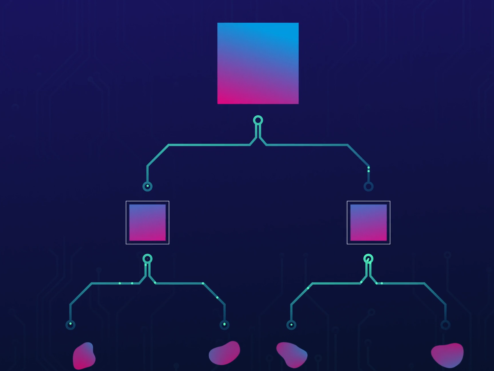
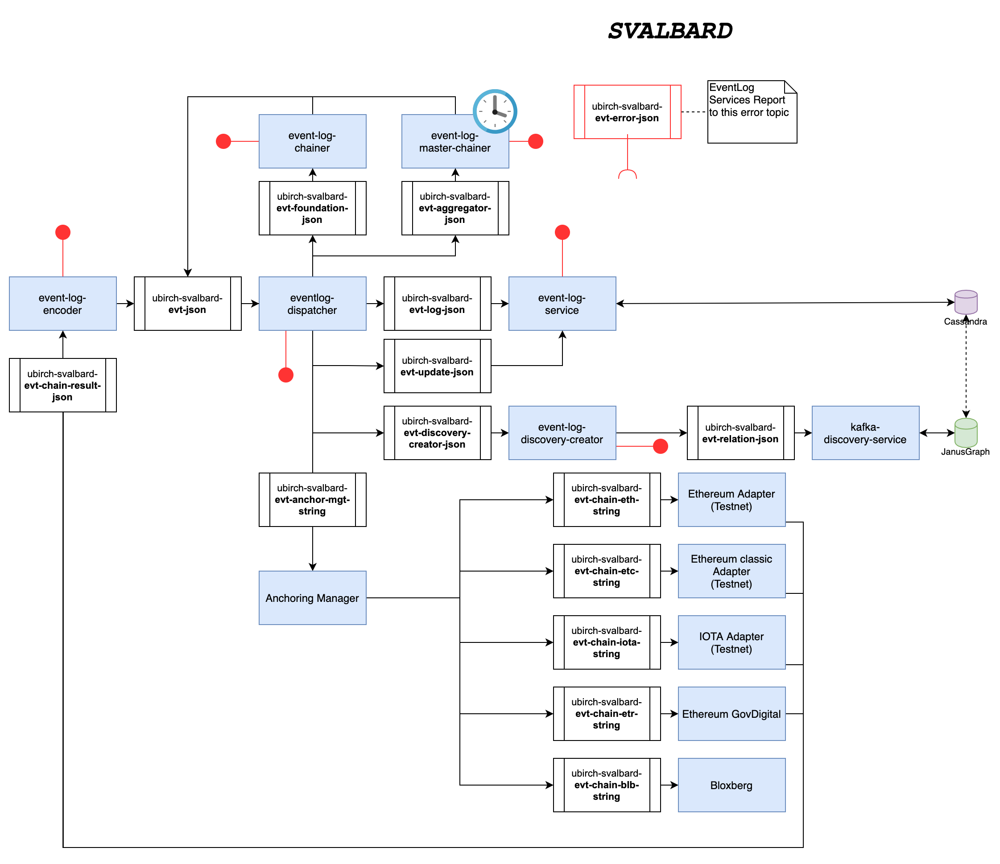

# UBIRCH EVENT LOG ECO-SYSTEM



The Event Log System is a collection of services that allow the creation, collection and aggregation of Merkle Trees that are connected with each other and that can be persisted and anchored into blockchains.

* [Event Log Service](./event-log-service)

* [Event Log Dispatcher](./event-log-dispatcher)

* [Event Log Encoder](./event-log-encoder)

* [Event Log Chainer](./event-log-chainer)

* [Event Log Kafka Lookup](./event-log-kafka-lookup)

* [Event Log SDK](./event-log-sdk)

* [Event Log Discovery Creator](./event-log-discovery-creator)

* [Event Log Verification](./event-log-verification-service)

* [Anchoring Manager](https://github.com/ubirch/ubirch-anchoring-manager)



## Helper Libs

* [Event Log Core](./event-log-core)

* [Kafka Express](https://github.com/ubirch/ubirch-kafka-express)

* [Kafka Envelope](https://gitlab.com/ubirch/ubirch-kafka-envelope)

## Prerequisites 

In order to run the applications, you will need a running instance of Kafka and Cassandra. 

Please refer to [DB Migrations](https://github.com/ubirch/ubirch-cassandra-eval#db-migrations-management) in order to run the
migration scripts.

## Install

To build the application run the following command:

```
    mvn install
```

After doing this, you can drill down to working on the
particular project you may be interested in.

## Useful Scripts

**migrateDb.sh** Helps in the migration of the db evolution scripts.

## Prometheus Metrics

**Note**: If you're starting the multiple services on the same machine/jvm, the port might change, and
you will have to change it accordingly. The port that is assigned to Prometheus is show on the console of 
every service at boot.

```
  (1) http://localhost:4321/
```

  or
   
```  
   (2) watch -d "curl --silent http://localhost:4321 | grep SERVICE-NAME"
```

You can inspect the service name by running option (1) and finding "service" 


