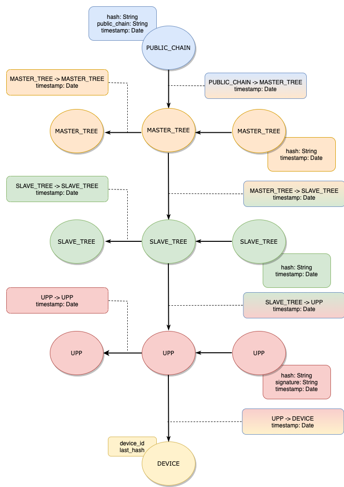
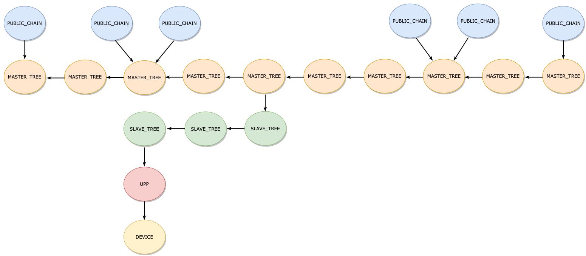

# UBIRCH EVENT LOG DISCOVERY CREATOR SYSTEM

A system that allows to create the necessary relations from event logs.

There are 5 types of vertex.
1. PUBLIC_CHAIN
2. MASTER_TREE
3. SLAVE_TREE
4. UPP
5. DEVICE

Each vertex has a timestamp. A higher vertex has bigger timestamp.

