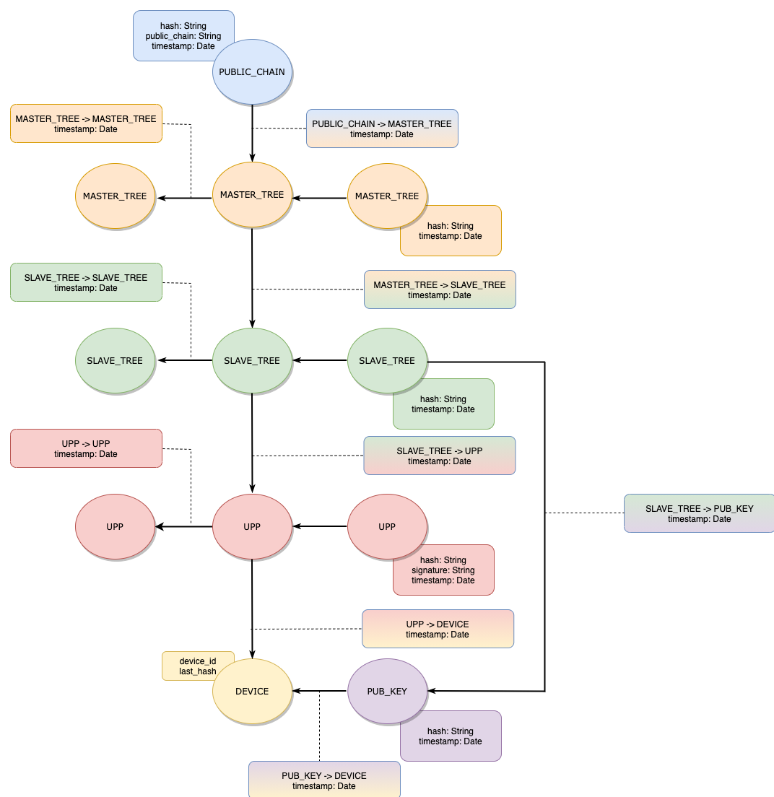

# UBIRCH EVENT LOG DISCOVERY CREATOR SYSTEM

A system that allows to create the necessary relations from event logs.

The relations represent the graph structure looking like this image below.
There are 6 types of a vertex.
1. PUBLIC_CHAIN: this vertex links to the other a PUBLIC_CHAIN vertex or MASTER_TREE vertex.
2. MASTER_TREE: this vertex links to the other a MASTER_TREE vertex or SLAVE_TREE vertex.
3. SLAVE_TREE: this vertex links to the other a SLAVE_TREE vertex or UPP vertex.
4. UPP: this vertex links to the other a UPP vertex or DEVICE vertex.
5. PUB_KEY: this vertex links to a DEVICE vertex.
6. DEVICE

Each vertex has a timestamp. A higher vertex has a bigger timestamp, which means a higher vertex is created latest.

Normally, this schema doesn't look like a linear graph like the image above.
As an example, this schema could look like the image below.
