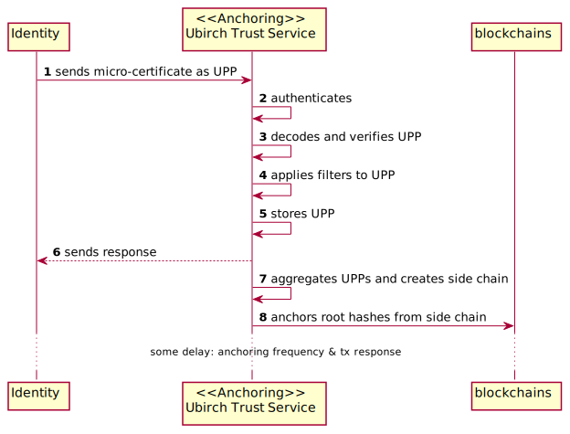

# Verification 

**Note**: For the following examples, you should take into account the environment you are working on. DEV, DEMO or PRO and change the URL accordingly.

**Note**: Verifications 2, 3, and 4, check for the validity of the upp in terms of signature of the upp, chain and unpacking.

This system talks internally to the Identity Service: https://github.com/ubirch/ubirch-id-service to retrieve the available keys.

* [Endpoints V1](V1.md)
* [Endpoints V2](V2.md)
* [Access Token For Endpoints V2](AccessToken.md)

# Anchoring Workflow

# Verification Workflow

