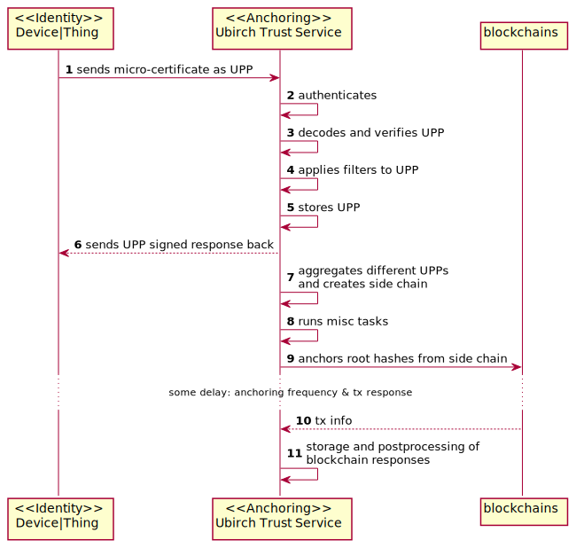

# Verification

1. [Description](#verification-descriptions)
2. [Verification Workflow](#verification-workflow)
3. [Endpoints V1](V1.md)
4. [Endpoints V2](V2.md)
5. [Access Token For Endpoints V2](AccessToken.md)

# Verification Descriptions

There currently exists 4 layers of verifications that can be performed on a UPP(hash).

1. `Initial verification`: It checks that the upp has been stored on our backend. No further checks are performed apart
   from a structural check of the upp. You may think about this as a quick check.
2. `Simple verification`: This verification checks the existence of the upp in our backend and additionally, it checks
   the "chain" and the validity of the "keys". That's to say that the UPP can be cryptographically verified by one of
   the available keys for the particular device/entity.
3. `Upper verification`: This verification checks the existence of the upp in our backend, it checks the "chain"; and
   the validity of the "keys" (That the UPP can be verified by one of the available keys for the particular
   device/entity); and retrieves the upper bounds or the closet blockchains transactions in the near future.
4. `Full verification`: This verification checks the existence of the upp in our backend, it checks the "chain"; and the
   validity of the "keys" (That the UPP can be verified by one of the available keys for the particular device/entity);
   and retrieves the upper and lower bounds or the closet blockchains transactions in the near future and past.

# Verification Workflow

This diagram shows the 4 types of verifications that are currently supported.

> This system talks internally to the Identity Service: https://github.com/ubirch/ubirch-id-service to retrieve the available keys, and to the cassandra storage, both for checking event logs, and paths to verifications.

# Anchoring Workflow

This workflow is a simplified version of the anchoring workflow. It shows the most important and relevant activities
that are performed when a UPP is received. Note that since number 5 or 6, which are presented in the following diagram,
an initial verification is possible.

